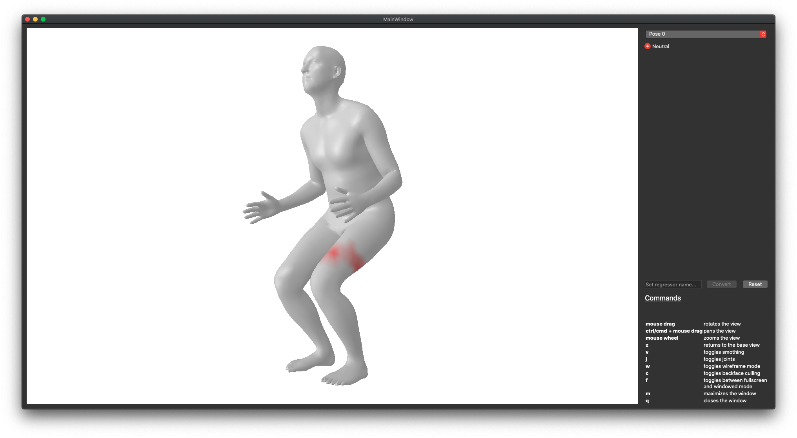
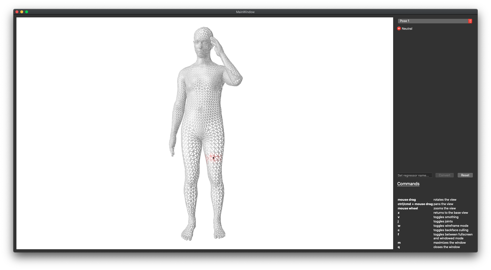
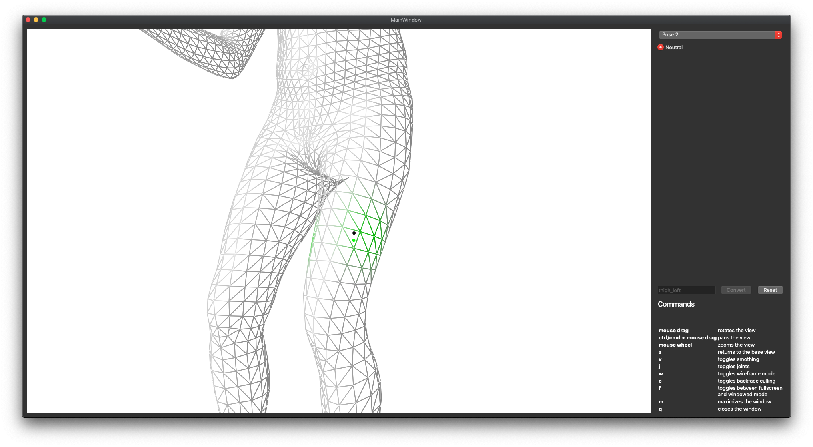
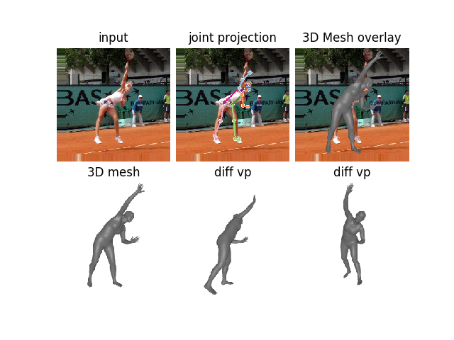

# Domain Analysis of End-to-end Recovery of Human Shape and Pose

This repository is part of my master thesis "Analysis of Domain Adaptability for 3D Human Pose Estimation with Explicit 
Body Shape Models" based on [End-to-end Recovery of Human Shape and Pose](https://github.com/akanazawa/hmr/).

It contains a reimplementation in Tensorflow 2.x of the original code and a tool to generate custom regressors to add 
new keypoints.


As mentioned in [[1]](https://arxiv.org/pdf/1712.06584.pdf)

> New keypoints can easily be incorporated with the mesh representation by specifying the
> corresponding vertexID.
 
the tool even allows to add more complex keypoints by specifying a set of vertices. 
Therefore a keypoint ${\bold k}$ must be specified by defining the set of vertices on a set of meshes ${\bold M}$ containing different poses and 
shapes.

 | 
-|- 
example of defined set of vertices on a single mesh | the actual keypoint is defined by $k = \overline{\bold k}$


Given the set of keypoints ${\bold K}$ the new regression vector ${\bold j}$ is computed 
using non-negative least squares (see 4.1 [SMPL2015](http://files.is.tue.mpg.de/black/papers/SMPL2015.pdf))




#### Requirements
- Python > 3.6 

#### Installation

*I recommend using a virtual environment using virtualenvwrapper*

```
pip3.x install --upgrade --user virtualenv
pip3.x install --upgrade --user virtualenvwrapper
```

Add follwing to your `.bashrc` or `.zshrc`
```
export WORKON_HOME=$HOME/.virtualenvs
# (optional) set export paths to your local python and virtualenv 
# export VIRTUALENVWRAPPER_PYTHON=/usr/local/bin/python3.x 
# export VIRTUALENVWRAPPER_VIRTUALENV=/usr/local/bin/virtualenv
source /usr/local/bin/virtualenvwrapper.sh
```

##### setup virtual environment
```
mkvirtualenv hmr2.0
workon hmr2.0
pip install -U pip

# check requirements.txt first for chosing between tensorflow or tensorflow-gpu
pip install -r requirements.txt

# additionally requirements for the tool can be installed as well 
pip install -r keypoint_marker/requirements.txt
```

##### run demo 
1. download one of the pre trained models
- [LSP pretrained](https://github.com/russoale/hmr2.0/releases/download/1.0/trained_lsp.zip)
- [LSP+toes pretrained](https://github.com/russoale/hmr2.0/releases/download/1.0/trained_lsp_plus_toes.zip)

2. create `logs` folder
```
mkdir logs/lsp_toes # or logs/lsp
```
3. unpack checkpoint files 
4. run demo 
```
cd src/notebooks
python trimesh_renderer.py
```




#### Datasets 


Download following datasets 
- [LSP](http://sam.johnson.io/research/lsp_dataset.zip)
- [LSP extended](http://sam.johnson.io/research/lspet_dataset.zip)
- [COCO 2017 Train/Val](http://cocodataset.org/#download)
- [MPII](http://human-pose.mpi-inf.mpg.de/#download)
- [MPI-INF-3DHP](http://gvv.mpi-inf.mpg.de/3dhp-dataset/)

Following datasets can be downloaded but can't be generated via dataset_preprocessing scripts due to a pre-computed proprietary dataset format
- [Human3.6M](http://vision.imar.ro/human3.6m/description.php)
- [Total Capture](https://cvssp.org/data/totalcapture/)


If you use the datasets above, please cite the original papers and follow the individual license agreement!

To generate TFRecord files update paths in `datasets_preprocessing/convert_datasets.sh` and run the script.


#### Training 

1. update paths in `src/main/config.py` 
2. (optional) Run `src/notebooks/inspect_dataset.ipynb` to update samples count for correct display of progress bar (requires jupyter installation)
3. train 
```
cd src/main
python model.py
```
