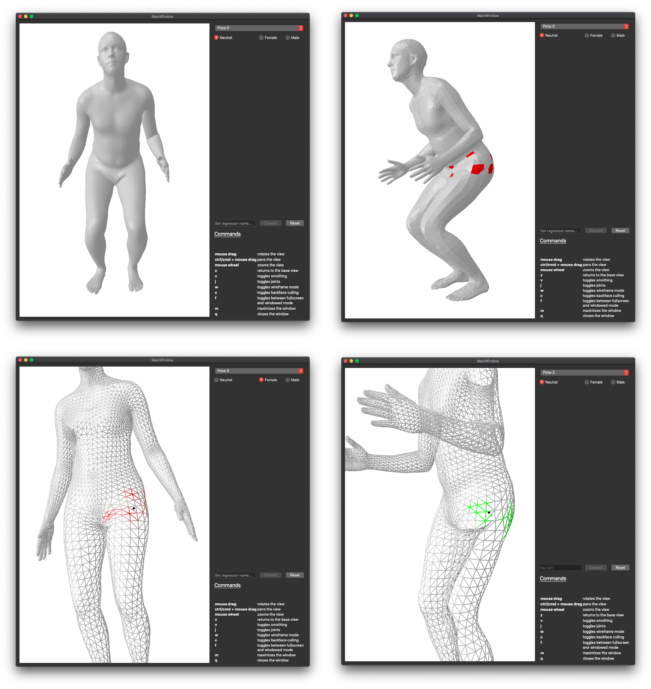
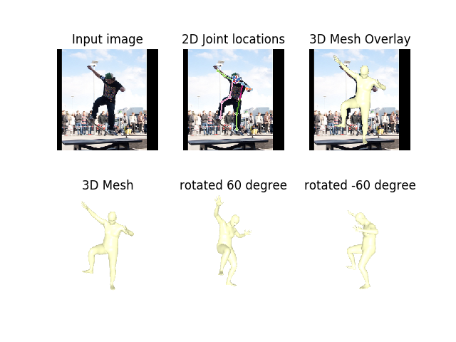
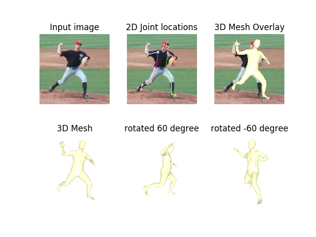

# Domain Analysis of End-to-end Recovery of Human Shape and Pose

[]()
[](https://github.com/russoale/hmr2.0/actions/workflows/build-and-test.yml)
[](LICENSE)

This repository is part of the master thesis with the title: "Analysis of Domain Adaptability for 3D Human Pose Estimation with Explicit 
Body Shape Models" based on [End-to-end Recovery of Human Shape and Pose](https://akanazawa.github.io/hmr).

This repository contains:
- reimplemented version of the [original code](https://github.com/akanazawa/hmr)
- a keypoint annotation tool to generate new keypoint regressors
    - integrates directly into the HMR framework
    - compatible with the SMPL model [2]


> According to Kanazawa et al. [1],
> new keypoints can easily be incorporated with the mesh representation by specifying the
> corresponding vertexID.
> This feature makes the HMR framework very powerful.
> However, the definition of a general joint of the human body is more complex than just a single point on the surface.
> To address this problem, a new keypoint annotation tool has been developed that allows to generate a new keypoint regressor of a more complex keypoint.
> A detailed description of the annotation process and an installation guide can be found in [keypoint_annotation_tool/README.md](keypoint_annotation_tool/README.md).



## Requirements
- Python > 3.6
- Tensorflow > 2.1

## Installation

#### Recommended Environment Setup
If you already have your environment set up, skip this and continue with `Install Requirements`.

1. Install `virtualenv` and `virtualenvwrapper`:
    ```
    pip3.x install --upgrade --user virtualenv
    pip3.x install --upgrade --user virtualenvwrapper
    ```

2. Add following to your `.bashrc` or `.zshrc`:
    ```
    export WORKON_HOME=$HOME/.virtualenvs
    # (optional) set export paths to your local python and virtualenv 
    # export VIRTUALENVWRAPPER_PYTHON=/usr/local/bin/python3.x 
    # export VIRTUALENVWRAPPER_VIRTUALENV=/usr/local/bin/virtualenv
    source /usr/local/bin/virtualenvwrapper.sh
    ```
3. set up the virtual environment
    ```
    mkvirtualenv hmr2.0
    workon hmr2.0
    pip install -U pip
    ```
   
#### Install Requirements

- check requirements.txt: choose between `tensorflow` (default) or `tensorflow-gpu`
- install requirements
    ```
    pip install -r requirements.txt
    ```

#### run demo 

1. Create `logs` folder
    ```
    mkdir -p logs/paired(joints) && logs/unpaired
    ```
2. Download and unpack one of the pre trained models in the appropriate folder:
    - trained in paired setting (no SMPL parameter supervision due to missing dataset)
        - [Base Model (LSP)](https://github.com/russoale/hmr2.0/releases/download/2.0/base_model.paired.zip)
        - [Toes Model (LSP + toes)](https://github.com/russoale/hmr2.0/releases/download/2.0/base_model.paired.zip)
        - [Total Capture Model (LSP)](https://github.com/russoale/hmr2.0/releases/download/2.0/total_capture_model.paired.zip) (original datasets plus Total Capture)
        - [Final Model (LSP + toes)](https://github.com/russoale/hmr2.0/releases/download/2.0/toes_model.paired.zip) (original datasets plus Total Capture)
        - [Tool Model (LSP)](https://github.com/russoale/hmr2.0/releases/download/2.0/tool_model.paired.zip) (original regressor with exchanged shoulder regressors )
        
    - trained in unpaired setting
        - [Base Model (LSP)](https://github.com/russoale/hmr2.0/releases/download/2.0/base_model.unpaired.zip)
        - [Toes Model (LSP + toes)](https://github.com/russoale/hmr2.0/releases/download/2.0/toes_model.unpaired.zip)
        - [Total Capture Model (LSP)](https://github.com/russoale/hmr2.0/releases/download/2.0/total_capture_model.unpaired.zip) (original datasets plus Total Capture)
        - [Final Model (LSP + toes)](https://github.com/russoale/hmr2.0/releases/download/2.0/final_model.unpaired.zip) (original datasets plus Total Capture)
3. (optional) All Models ending with `(LSP + toes)` need the toes regressors 
    - link or copy the regressors folder from keypoint_annotation_tool to the models folder:
    ```
    cp -r /keypoint_annotation_tool/regressors
    # or
    cd models && ln -s ../keypoint_annotation_tool/regressors
    ```
4. Run demo `cd src/visualise` 
    ```
    python demo.py --image=coco1.png --model=base_model --setting=paired\(joints\) --joint_type=cocoplus --init_toes=false
    ```
    
    
    ```
    python demo.py --image=lsp1.png --model=base_model --setting=paired\(joints\) --joint_type=cocoplus --init_toes=true
    ```
    

*Note! No camera applied on the Mesh Overlay - Trimesh doesn't support orthographic projection)*


#### Training 

1. Convert datasets into TF Record format, see [datasets_preprocessing/README.md](../../datasets_preprocessing/README.md) 
2. Update `ROOT_DATA_DIR` in [src/main/config.py](src/main/config.py) 
2. (optional) Run `src/visualise/notebooks/inspect_chekpoint.ipynb` to update samples count in config for correct display of progress bar (requires jupyter installation)
3. Run training 
    ```
    cd src/main
    python model.py > train.txt 2>&1 &!
    ```

Training takes up to 2 days on a RTX 2080 Ti GPU!

#### Evaluation
See [eval/README.md](src/eval/README.md)


### Source
|||
|---|---|
|[[1]](https://arxiv.org/pdf/1712.06584.pdf) |Angjoo Kanazawa, Michael J. Black, David W. Jacobs, and Jitendra Malik. “End-to-end Recovery of Human Shape and Pose”. In: Computer Vision and Pattern Recognition (CVPR). 2018|
|[[2]](http://files.is.tue.mpg.de/black/papers/SMPL2015.pdf) |Matthew Loper, Naureen Mahmood, Javier Romero, Gerard Pons-Moll, and Michael J. Black. “SMPL: A Skinned Multi-Person Linear Model”. In: ACM Trans. Graphics (Proc. SIGGRAPH Asia) 34.6 (Oct. 2015), 248:1– 248:16.|
